Seg2Sat - Segmentation to satellite view with ControlNet
======

## Description

Seg2Sat is a project that explores the potential of exploiting algorithms such as [StableDiffusion](https://github.com/CompVis/stable-diffusion) and [ControlNet](https://github.com/lllyasviel/ControlNet) to generate aerial images based on terrain segmentation data. By leveraging IGN's [FLAIR (French Land cover from Aerospace ImageRy)](https://ignf.github.io/FLAIR/) dataset, which provides land cover information for various regions in France, this project aims to create visually appealing synthetic aerial photographs that resemble real or stylized aerial imagery.  

Image Segmentation                   |  Generated Image           |  Generated Image
:-----------------------------------:|:--------------------------:|:-------------------------:
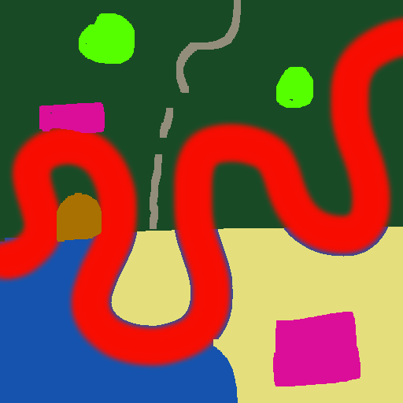       |  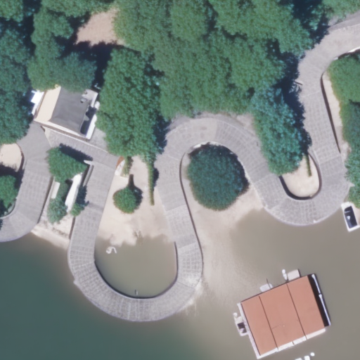 | 
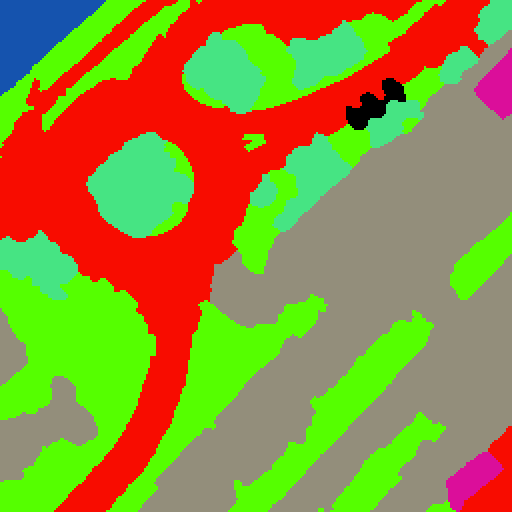  |  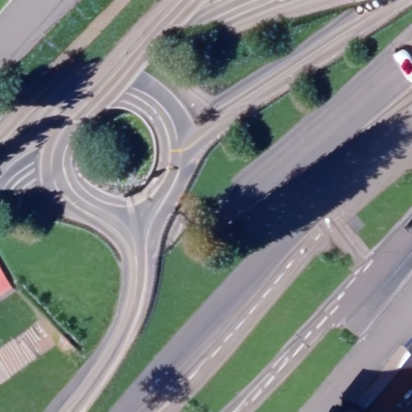  | 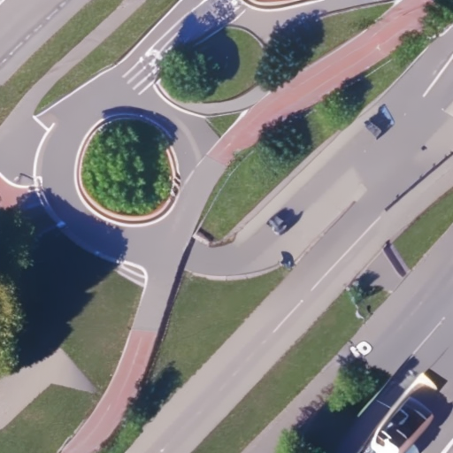
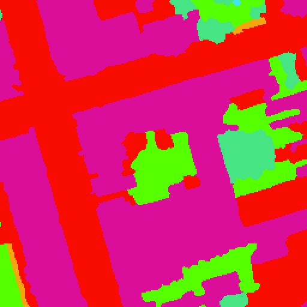  |  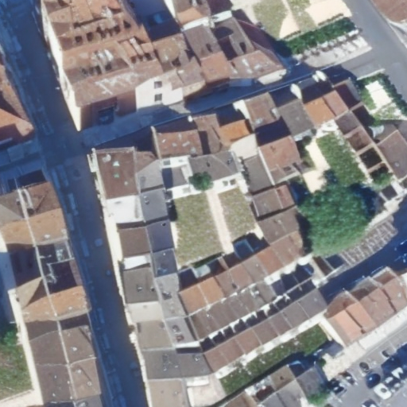  | 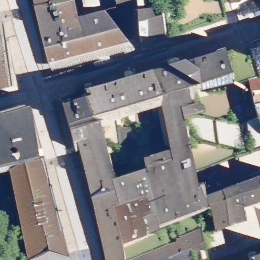

<details>
   <summary>Legend from the FLAIR dataset documentation</summary>
   <table style="width:80%;max-width:700px;">
      <thead>
         <tr>
            <th width="7%"></th>
            <th>Class</th>
            <th style="text-align: center" width="15%">Value</th>
            <th style="text-align: center">Freq.-train (%)</th>
            <th style="text-align: center">Freq.-test (%)</th>
         </tr>
      </thead>
      <tbody>
         <tr>
            <td></td>
            <td>building</td>
            <td style="text-align: center">1</td>
            <td style="text-align: center">8.14</td>
            <td style="text-align: center">8.6</td>
         </tr>
         <tr>
            <td></td>
            <td>pervious surface</td>
            <td style="text-align: center">2</td>
            <td style="text-align: center">8.25</td>
            <td style="text-align: center">7.34</td>
         </tr>
         <tr>
            <td></td>
            <td>impervious surface</td>
            <td style="text-align: center">3</td>
            <td style="text-align: center">13.72</td>
            <td style="text-align: center">14.98</td>
         </tr>
         <tr>
            <td></td>
            <td>bare soil</td>
            <td style="text-align: center">4</td>
            <td style="text-align: center">3.47</td>
            <td style="text-align: center">4.36</td>
         </tr>
         <tr>
            <td></td>
            <td>water</td>
            <td style="text-align: center">5</td>
            <td style="text-align: center">4.88</td>
            <td style="text-align: center">5.98</td>
         </tr>
         <tr>
            <td bgcolor="#194a26"></td>
            <td>coniferous</td>
            <td style="text-align: center">6</td>
            <td style="text-align: center">2.74</td>
            <td style="text-align: center">2.39</td>
         </tr>
         <tr>
            <td bgcolor="#46e483"></td>
            <td>deciduous</td>
            <td style="text-align: center">7</td>
            <td style="text-align: center">15.38</td>
            <td style="text-align: center">13.91</td>
         </tr>
         <tr>
            <td bgcolor="#f3a60d"></td>
            <td>brushwood</td>
            <td style="text-align: center">8</td>
            <td style="text-align: center">6.95</td>
            <td style="text-align: center">6.91</td>
         </tr>
         <tr>
            <td bgcolor="#660082"></td>
            <td>vineyard</td>
            <td style="text-align: center">9</td>
            <td style="text-align: center">3.13</td>
            <td style="text-align: center">3.87</td>
         </tr>
         <tr>
            <td bgcolor="#55ff00"></td>
            <td>herbaceous vegetation</td>
            <td style="text-align: center">10</td>
            <td style="text-align: center">17.84</td>
            <td style="text-align: center">22.17</td>
         </tr>
         <tr>
            <td bgcolor="#fff30d"></td>
            <td>agricultural land</td>
            <td style="text-align: center">11</td>
            <td style="text-align: center">10.98</td>
            <td style="text-align: center">6.95</td>
         </tr>
         <tr>
            <td bgcolor="#e4df7c"></td>
            <td>plowed land</td>
            <td style="text-align: center">12</td>
            <td style="text-align: center">3.88</td>
            <td style="text-align: center">2.25</td>
         </tr>
         <tr>
            <td bgcolor="#3de6eb"></td>
            <td>swimming pool</td>
            <td style="text-align: center">13</td>
            <td style="text-align: center">0.03</td>
            <td style="text-align: center">0.04</td>
         </tr>
         <tr>
            <td bgcolor="#ffffff"></td>
            <td>snow</td>
            <td style="text-align: center">14</td>
            <td style="text-align: center">0.15</td>
            <td style="text-align: center">-</td>
         </tr>
         <tr>
            <td bgcolor="#8ab3a0"></td>
            <td>clear cut</td>
            <td style="text-align: center">15</td>
            <td style="text-align: center">0.15</td>
            <td style="text-align: center">0.01</td>
         </tr>
         <tr>
            <td bgcolor="#6b714f"></td>
            <td>mixed</td>
            <td style="text-align: center">16</td>
            <td style="text-align: center">0.05</td>
            <td style="text-align: center">-</td>
         </tr>
         <tr>
            <td bgcolor="#c5dc42"></td>
            <td>ligneous</td>
            <td style="text-align: center">17</td>
            <td style="text-align: center">0.01</td>
            <td style="text-align: center">0.03</td>
         </tr>
         <tr>
            <td bgcolor="#9999ff"></td>
            <td>greenhouse</td>
            <td style="text-align: center">18</td>
            <td style="text-align: center">0.12</td>
            <td style="text-align: center">0.2</td>
         </tr>
         <tr>
            <td bgcolor="#000000"></td>
            <td>other</td>
            <td style="text-align: center">19</td>
            <td style="text-align: center">0.14</td>
            <td style="text-align: center">-</td>
         </tr>
      </tbody>
   </table>
</details>  

<br>

## Image stylization with prompt engineering

Since this is derived from a general text-to-image model it is also possible to guide the generation further by modifying the prompt.  

Prompting can be used for guiding image style, seasonality, and architechture.

The following images were generated using the prompt `<style>, aerial view of 31 Rue Molière, France` :

  Colorful lego brick      |  Detailed pencil sketch | Oil on canvas painting
:-------------------------:|:-------------------------:|:-------------------------:|
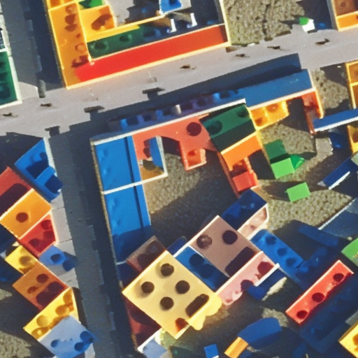  |  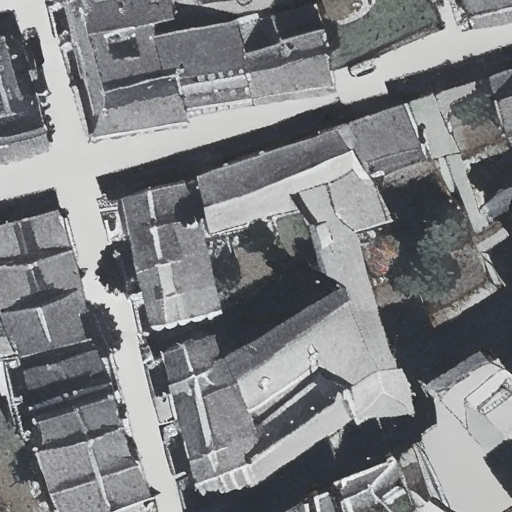 | 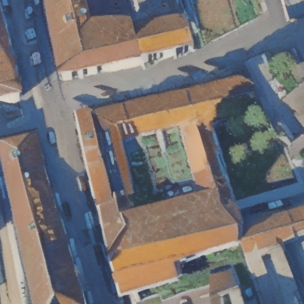

## How to use

### Drawing2Map web user interface

This project also comes with a webui to generate images from drawings


- The webui can be used through this HuggingFace space: https://huggingface.co/spaces/rgres/Seg2Sat
- You can also run it locally: `cd ui && pip install -r requirements.txt && python start_webui.py`
- or with Google Colab: <a href="https://colab.research.google.com/github/RubenGres/Seg2Sat/blob/main/Drawing2Map_webui.ipynb" target="_parent"></a>

### Diffusers library

```python
from diffusers import StableDiffusionControlNetPipeline, ControlNetModel
from diffusers import StableDiffusionControlNetPipeline
from diffusers.utils import load_image
import torch

controlnet = ControlNetModel.from_pretrained("rgres/sd-controlnet-aerialdreams", torch_dtype=torch.float16)

pipe = StableDiffusionControlNetPipeline.from_pretrained(
    "stabilityai/stable-diffusion-2-1-base", controlnet=controlnet, torch_dtype=torch.float16
)

image = load_image("https://raw.githubusercontent.com/RubenGres/AerialDreams/main/validation/mask/MSK_076201.png")

image = pipe(
   prompt="High resolution image, 4K, ultra detailed, aerial view of 31 Rue Molière, France.", num_inference_steps=20, image=image
).images[0]

image.show()
```

<a href="https://colab.research.google.com/github/RubenGres/Seg2Sat/blob/main/Seg2Sat_inference_example.ipynb" target="_parent"></a>

## Download the model

The trained weights are available on HuggingFace [here](https://huggingface.co/rgres/sd-controlnet-aerialdreams)

## About the dataset

To facilitate the use of StableDiffusion, a custom dataset has been derived from the FLAIR dataset. The TIFF images have been converted to PNG format for convenience, and the image segmentation process incorporates the recommended Look-Up Table (LUT) from the dataset documentation. Location data and descriptions have been gathered from the TIF files and the OpenStreetMap API to enrich the dataset, enabling the creation of meaningful labels for each image.  

Each label is in the form `Aerial view of <OSM display_name>. <classes>`  
*e.g. Aerial view of Pays de la Loire, France métropolitaine, 49260, France. brushwood, deciduous, herbaceous vegetation*

The complete dataset, consisting of over 61,000 images, can be accessed on HuggingFace [here](https://huggingface.co/datasets/rgres/AerialDreams).

## File Structure

This github repo consists of the following directories:

- `controlnet_training/`: Contains everything needed to train the ControlNet model with validation images.
- `dataset_preparation/`: Contains the code used to convert the FLAIR#1 dataset.
- `scripts/`: Contains a simple example on how to use this project, with the diffuser API or a simple gradio interface.
- `ui/`: Contains the code for the complete interface allowing you to draw from your browser
- `images/`: All images used in the README.md file

## Limitations

One limitation of this project is that the FLAIR dataset covers France only. As a result, the learned representation and generated images may be biased towards French terrain. The model might struggle to accurately render other types of terrain outside of France. Future improvements could involve expanding the dataset to include a more diverse range of regions and landscapes.  

Also theses results are obtained using a ControlNet on the base StableDiffusion 2.1 model. More details could be obtained in the generated images by finetuning a diffusion model on aerial imaging.
